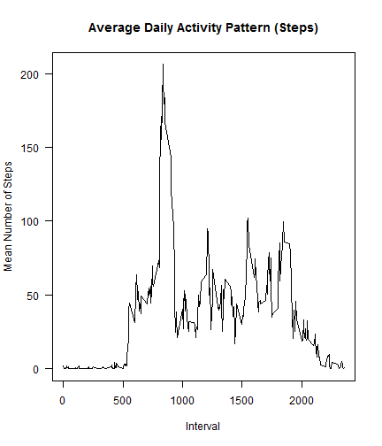
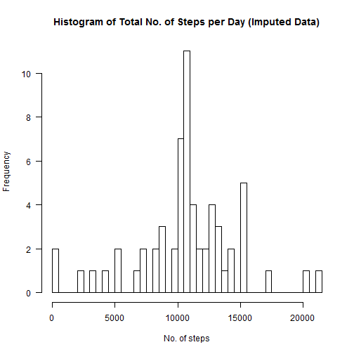
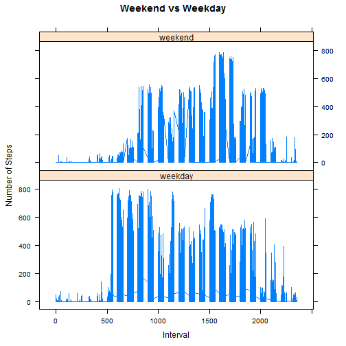

## Loading and preprocessing the data

###1. Extract the csv file from the zip archive and read the file


```r
unzip("activity.zip")

data <- read.csv("activity.csv")
```
A quick look at the data 


```r
summary(data)
```

```
##      steps                date          interval     
##  Min.   :  0.00   2012-10-01:  288   Min.   :   0.0  
##  1st Qu.:  0.00   2012-10-02:  288   1st Qu.: 588.8  
##  Median :  0.00   2012-10-03:  288   Median :1177.5  
##  Mean   : 37.38   2012-10-04:  288   Mean   :1177.5  
##  3rd Qu.: 12.00   2012-10-05:  288   3rd Qu.:1766.2  
##  Max.   :806.00   2012-10-06:  288   Max.   :2355.0  
##  NA's   :2304     (Other)   :15840
```
  
###2. Add libraries

```r
library(plyr)
library(lattice)
library(chron)
```

###3. Process the data to remove NAs


```r
dataNoNull <- subset(data, !(is.na(steps)))
```


## What is mean total number of steps taken per day?

###4. Calculate to total number of steps per day  

```r
byDay <- dataNoNull[,-3]
sumDay <- aggregate(.~date, data=byDay, FUN = sum)
```
###5. Plot the Histogram for the total number of steps per day  

This shows the distribution of the daily sums of steps taken  


```r
hist(sumDay$steps, main = "Histogram of Total No. of Steps per Day", las=1, xlab = "No. of steps", breaks = 53)
```

 

###6. calculate the Daily means and medians

Daily Means

```r
meanDay <- aggregate(.~date, data=byDay, FUN = mean)

meanDays <- mean(meanDay$steps)
```
The mean number of steps for all days is 37.3825996

Daily medians

```r
medianDay <- aggregate(.~date, data=byDay, FUN = median)

medianDays <- median(medianDay$steps)
```
The median number of steps for all days is 0


## What is the average daily activity pattern?

###7. Plot the mean steps by interval


```r
byInt <- dataNoNull[,-2]
sumInt <- aggregate(.~interval, data=byInt, FUN = mean)
```

```r
plot.ts(sumInt$interval,sumInt$steps, type = "l",las = 1, main="Average Daily Activity Pattern (Steps)", xlab="Interval",ylab="Mean Number of Steps")
```

 

###8. Get the interval with maximum mean number of steps


```r
max<- sumInt[which(sumInt$steps == max(sumInt$steps)), ]
```
The mean maximum number of steps 206.1698113 occur at the 835 interval.

## Imputing missing values

###9. Calculate how many missing values there are


```r
summary(data)
```

```
##      steps                date          interval     
##  Min.   :  0.00   2012-10-01:  288   Min.   :   0.0  
##  1st Qu.:  0.00   2012-10-02:  288   1st Qu.: 588.8  
##  Median :  0.00   2012-10-03:  288   Median :1177.5  
##  Mean   : 37.38   2012-10-04:  288   Mean   :1177.5  
##  3rd Qu.: 12.00   2012-10-05:  288   3rd Qu.:1766.2  
##  Max.   :806.00   2012-10-06:  288   Max.   :2355.0  
##  NA's   :2304     (Other)   :15840
```
The summary() of the dataset suggests there are 2304 NAs in the steps data.  
This is confirmed by the following:

```r
NAsteps <- sum(is.na(data$steps))
percentNA <- mean(is.na(data$steps))*100
```
So the total number of missing values is 2304 which equates to 13.1147541% of the steps data. 

###10. A strategy to fill in the missing values in the dataset.  
The strategy to fill in the missing values in the dataset that will be adopted in this report is to replace the missing value with the mean for that interval. 

```r
ex1 <- sumInt[21,]
```
For example the mean steps for interval 140 is 0.1698113. So for every NA in interval 140 we will substitute the value 0.1698113. 

###11. Create the new dataset with no missing values


```r
impute.mean <- function(x) replace(x, is.na(x), mean(x, na.rm = TRUE))
newData <- ddply(data, ~ interval, transform, steps = impute.mean(steps))

summary(newData)
```

```
##      steps                date          interval     
##  Min.   :  0.00   2012-10-01:  288   Min.   :   0.0  
##  1st Qu.:  0.00   2012-10-02:  288   1st Qu.: 588.8  
##  Median :  0.00   2012-10-03:  288   Median :1177.5  
##  Mean   : 37.38   2012-10-04:  288   Mean   :1177.5  
##  3rd Qu.: 27.00   2012-10-05:  288   3rd Qu.:1766.2  
##  Max.   :806.00   2012-10-06:  288   Max.   :2355.0  
##                   (Other)   :15840
```

```r
newDataNA <- sum(is.na(newData$steps))
```
The summary() and newDataNA check show there are 0 missing values.

###12. Plot the Histogram for the total number of steps per day with the new dataset


```r
sumNewDay <- aggregate(.~date, data=newData, FUN = sum)

hist(sumNewDay$steps, main = "Histogram of Total No. of Steps per Day (Imputed Data)", las=1, xlab = "No. of steps", breaks = 61)  
```

 

New Daily Means

```r
meanNewDay <- aggregate(.~date, data=newData, FUN = mean)

meanNewDays <- mean(meanNewDay$steps)
```
The mean number of steps for all days is 37.3825996

New Daily medians

```r
medianNewDay <- aggregate(.~date, data=newData, FUN = median)

medianNewDays <- median(medianNewDay$steps)
```
The median number of steps for all days is 0  
This compares with a mean of 37.3825996 and median of 0 for the original dataset which shows that our startegy for imputing data has not affected these parameters. The summed number of steps per day has increased due to the imputed data.


## Are there differences in activity patterns between weekdays and weekends?

###13. Create a new factor variable for weekends and weekdays

```r
wendData <- newData
wendData$wend = chron::is.weekend(wendData$date)
wendData$wend <- factor(wendData$wend, labels = c('weekday', 'weekend'))
```

###14. Panel Plot of weekend and weekday number of steps

```r
xyplot(steps~interval | factor(wend), data=wendData, pch=19, main="Weekend vs Weekday", xlab="Interval",  ylab="Number of Steps",layout=c(1,2),type="l")  
```

 
  
**End of Report**
